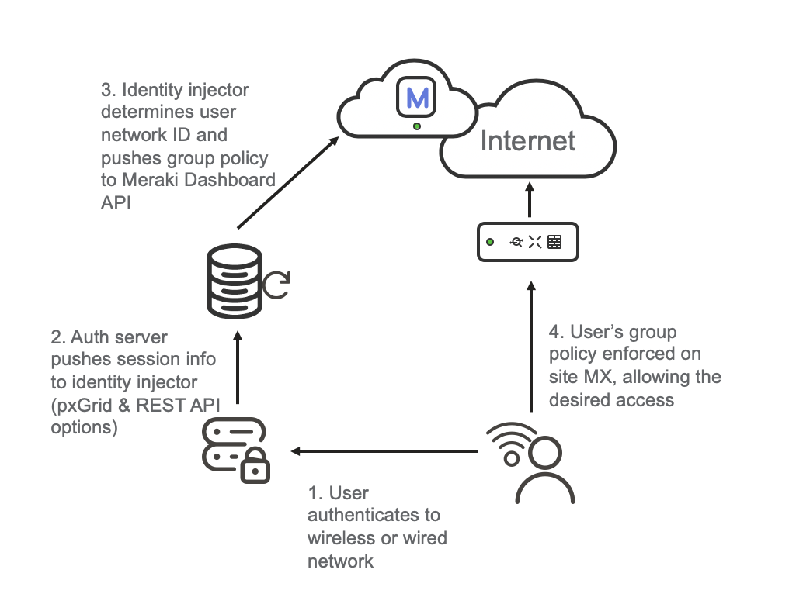

# Meraki Identity Injector

This proof-of-concept application allows a third-party AAA server to apply group policies in
a Cisco Meraki Network. As implemented, any system capable of making a RESTful HTTP call to the API can use this,
it has been initially developed and tested with Aruba ClearPass. These instructions apply to ClearPass.

In a Meraki combined network (MX+MR) a client identity is shared throughout the network. Identity sourced during WiFi
authentication can be used for policy at the MX. This all works out of the box, no configuration needed. It’s a
beautiful thing. Customers implementing distributed MX appliances may have an existing investment in traditional
infrastructure and may not be able or willing to refresh to MR at this time. If ClearPass is currently used
for AAA services, that context is useful to the MX.



Overview and Demo Video (7m):  
[](https://youtu.be/nKbivPqtt5E)

## Goals and Impact
* Leverage user identity and authorization from AAA server to:
* Identify clients in Dashboard with a meaningful name (eg. User name) for easier operations
* Apply appropriate group policy to users
* Transparent to the user (ie. No splash pages or intrusive prompts)
* Operate without crushing infrastructure
* No WMI over RPC to scrape authentication logs from Active Directory
* Low IT operational overhead
* Easier, intuitive operations
* Investment protection for customers 
* Smooth migration & integration between cloud-managed and on-prem

## Preparing ClearPass

Starting with the assumption that you have ClearPass deployed for network authentication & authorization. At time
of development this was tested with ClearPass version 6.9 but does not depend on any recently-introduced capabilities.
Older versions should be compatible.

### ClearPass Configuration
1. Confirm basic 802.1x functionality is working as desired on the wired/wireless network, including integration
with external directories such as Microsoft Active Directory. Also appropriate roles that can be mapped to a
Group Policy in Meraki Dashboard. For testing, local users may be configured in the on board identity store.

    Ensure the network access devices are configured to send RADIUS accounting messages. These are required for
ClearPass to send the context notification.


2. If not already in use, enable Insight.  
     Browse to Administration > Server Manager > Server Configuration. On the Server Configuration page, select the
     ClearPass node you want to configure. The Server Configuration dialog opens. To enable the ClearPass Insight
     reporting tool on this node, select the Enable Insight check box.
     
3. Define the endpoint context server (Meraki Identity Injector). Browse to  Administration > External Servers >
Endpoint Context Servers. Add the Identity Injector. If you will enable SSL replace the port below with 8443.  
    Server Type: Generic HTTP Context Server  
    Server Name: `<DNS name or IP address of server>`  
	Base URL: `http://<dns name or IP address of server>:8080/api`  
	Authentication Method: Basic  
	Username: \<enter a username, you will configure it later\>    
	Password: \<enter a password\>  

4. Add an Endpoint Context Server Action  
    Browse to Administration > Dictionaries > Context Server Actions > Add  
	Server Type: Generic HTTP Context Server  
	Server Name: \<DNS name or IP address of server>  
	Action Name: `Meraki user-login`  
	HTTP Method: POST  
	Authentication Method: Basic  
	URL: `/user-login`  
	
	On the Header tab, add a header `Content-Type` with value `application/json`  
	
	On the Content Tab set Content-Type to application/json and set content to:  
    ```
    {"macAddress": "%{Connection:Client-Mac-Address-Colon}", 
    "ipAddress": "%{ip}", "userName": "%{Authentication:Username}", 
    "role": "%{Tips:Role}"}
    ```
   
5. Create an Enforcement Profile  
	Browse to Configuration > Enforcement > Profiles  
	Add a new Profile  
	Use the Session Notification Enforcement Template  
	Name: `Meraki Identity Injector - user-login`  
	Description: `send user logins to the context server`  

	On the Attributes Tab create three attributes:  
	Type: `Session-Notify`, Name: `Server Type`, Value: `Generic HTTP Context Server`  
	Type: `Session-Notify`, Name: `Server IP`, Value: `<choose your Meraki Identity Injector>`  
	Type: `Session-Notify`, Name: `Login Action`, Value: `Meraki user-login`  

6. Add Enforcement Profile to the existing Enforcement Policies  
    Browse to Configuration > Enforcement > Policies and choose the existing wireless enforcement policy  
    On the Rules tab select and edit a rule. 
    Add the new enforcement profile to be applied in addition to the existing one(s).
    Save your changes and repeat for all applicable enforcement policies.

7. Endpoint Context Server pushes are handled by the Async Network Service in ClearPass. By default the batch processing
interval is configured for 30 seconds. If desired, this can be reduced as low as 10 seconds. To do so:
    Browse to Administration > Server Manager > Server Configuration > Service Parameters.
    Choose Async network services in the service selection box if not already there.
    Modify the Batch Processing Interval as desired.
    Save and then restart the service to take effect.

## SSL Certificate for HTTP server (optional)
If enabling SSL you will need to create a server certificate. It's probably best to employ a signed certificate using
whatever processes are used for other services, but a self-signed certificate can be easily generated using openssl: 
    
    openssl req -x509 -sha256 -nodes -days 1095 -newkey rsa:2048 -keyout meraki-csrv.key -out meraki-csrv.crt

Copy the certificate and key file to the config folder of the app.

## Config.yaml
In the Meraki section, an API key with Org RW permission is needed. It is recommended that a dedicated service account
be created for this purpose. The Organization name needs to be supplied exactly as it is configured (case sensitive).

Redis is an in-memory key-value store that caches client mappings (as well as the list of network mappings.) This may
be run as a Docker container.  

In the HTTP Server section, specify a server salt value (any long random string you want) and define the username
and password that ClearPass will supply to authenticate to the API server.  If you'd like to enable SSL on the server
set the value to yes and specify the location of the certificate and key if they differ from defaults.

The profile map is used to define which Group Policies to map Authorization Profiles to. The group policy ID can be
found using the Meraki API call /networks/:networkId/groupPolicies. This assumes all networks will use a consistent
group policy ID for each purpose. The IDs are automatically generated sequentially so as long as the group polices are
created in the same order (or networks are bound to a common template, or cloned from a master) this will align.

## Preparing networks.csv
In an enterprise deployment with a distributed WAN, clients may be centrally authenticating from various sites.
Meraki-ise mapper determines which Meraki network ID is applicable by looking up the client IP Address in a table of
subnet-to-network mappings. This table is loaded from config/networks.csv.

A utility program genNetworkSubnetCSV.py has been included to crawl a Meraki organization and enumerate all directly
connected subnets at the site. The results are written to the networks.csv.

This table should be re-generated when VLAN/addressing/site changes are made. It may be a good idea to schedule a cron
job to automatically execute this periodically (eg. daily or weekly).

A sample with the required headings can be found in
`config/networks.sample.csv`.

## Running the code

The easiest way to run this application is using Docker. Alternatively the code can be run directly using Python.

### Docker

The included docker-compose.yml will build containers for the redis store, meraki-ise, meraki-csrv and redis-commander.
You will want to comment out either meraki-ise or meraki-csrv depending which identity engine youo're integrating with.
You may also want to comment redis-commander as it's not required other than for troubleshooting.

First you need to build the container: 
```
docker-compose build --pull
```

Then you can run the container:

```
docker-compose up
```

Note: If you'd like to run the containers in the background append `-d` to the `docker-compose up` call.

This will also mount the `config` subdirectory from this folder into the container.

### Virtualenv
You can also install and run natively using Virtualenv.

1. Create a new virtualenv:
   ```
   virtualenv -p python3 venv
   ```
2. Activate virtualenv:
    ```
   . venv/bin/activate
    ```
4. Install requirements:
   ```
   pip install -r requirements.txt
   ```
4. Run redis
   ```
   docker run -d -p 6379:6379 redis
   ```
5. Run application:
   ```
   python meraki-csrv.py
   ```