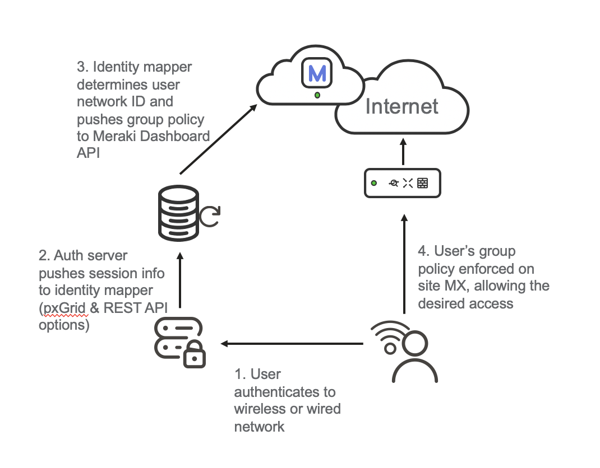

# Meraki Identity Injector

This proof-of-concept application uses Cisco Identity Services Engine (ISE) to apply group policies in 
a Cisco Meraki Network.

In a Meraki combined network (MX+MR) a client identity is shared throughout the network. Identity sourced during WiFi authentication can be used for policy at the MX. This all works out of the box, no configuration needed. It’s a beautiful thing.
Customers implementing distributed MX appliances may have an existing investment in Cisco Aironet, Catalyst, Identity Services Engine (ISE) and not able or willing to refresh to MR at this time.



[](https://youtu.be/nKbivPqtt5E)

## Goals and Impact
* Leverage user identity and authorization from ISE to:
* Identify clients in Dashboard with a meaningful name (eg. User name) for easier operations
* Apply appropriate group policy to users
* Transparent to the user (ie. No splash pages or intrusive prompts)
* Operate without crushing infrastructure
* No WMI over RPC to scrape authentication logs from Active Directory
* Low IT operational overhead
* Easier, intuitive operations
* Investment protection for Cisco customers
* Smooth migration & integration between cloud-managed and on-prem

## Preparing ISE

Ensure that you have a recent version (i.e. 2.4 or newer) of ISE deployed and have pxGrid Services enabled.
If you are running ISE 2.6 make sure you have at least version 2.6.0.156-Patch6-20031016. Some older versions contain 
a bug that prevents pxGrid events from being sent out over the WebSocket.

You will also need to create a client certificate that is used by the application to authenticate with ISE.

1. Launch the ISE Admin GUI using your browser
2. Navigate to Administration -> pxGrid Services
3. Click on the Certificates tab
4. Fill in the form as follows:
   - I want to:                   select "Generate a single certificate (without a certificate signing request)"
   - Common Name (CN):            fill in the name that you want the application to identify as
   - Certificate Download Format: select "Certificate in Privacy Enhanced Electronic Mail (PEM) format, key in PKCS8 PEM format (including certificate chain)"
   - Certificate Password:        fill in a password
   - Confirm Password:            fill in the same password as above
5. Click the 'Create' button. A ZIP file will be offered for download.
6. Extract the downloaded ZIP file. A new folder containing a few certificate files and a keyfile will be created.

From these files we are interested in the following three:
 - Our Client certificate and key: the two files prefixed with the Common Name you chose (.cer and .key)
 - The CA certificate: the file prefixed with the hostname of your ISE instance (.cer)

Before we can use the key file we will have to remove the password:
```
openssl rsa -in <common name>.key -out client.key
```
Enter the key's password to unlock and decrypt the key. Keep the key safe.

## Config.yaml
In the Meraki section, an API key with Org RW is needed. It is recommended that a dedicated service account be created 
for this purpose. The Organization name needes to be supplied exactly as it is configured (case sensitive).

Redis is an in-memory key-value store that caches client mappings (as well as the list of network mappings.) This may 
be run as a Docker container.  

You will need to have the required ISE certificates and keys in place here as well.

The profile map is used to define which Group Policies to map Authorization Profiles to. The group policy ID can be
found using the Meraki API call /networks/:networkId/groupPolicies. This assumes all networks will use a consistent 
group policy ID for each purpose. The IDs are automatically generated sequentially so as long as the group polices are 
created in the same order (or networks are bound to a common template, or cloned from a master) this will align.

## Preparing networks.csv
In an enterprise deployment with a distributed WAN, clients may be centrally authenticating from various sites. 
Meraki-ise mapper determines which Meraki network ID is applicable by looking up the client IP Address in a table of
subnet-to-network mappings. This table is loaded from config/networks.csv. 

A utility program genNetworkSubnetCSV.py has been included to crawl a Meraki organization and enumerate all directly 
connected subnets at the site. The results are written to the networks.csv.

This table should be re-generated when VLAN/addressing/site changes are made. It may be a good idea to schedule a cron 
job to automatically execute this periodically (eg. daily or weekly). 

A sample with the required headings can be found in
`config/networks.sample.csv`.

## Running the code

The easiest way to run this application is using Docker. Alternatively the code can be run directly using Python.

### Docker

The included docker-compose.yml will build containers for the redis store, meraki-ise, meraki-csrv and redis-commander.
You will want to comment out either meraki-ise or meraki-csrv depending which identity engine youo're integrating with. 
You may also want to comment redis-commander as it's not required other than for troubleshooting.

First you need to build the container: 
```
docker-compose build --pull
```

Then you can run the container:

```
docker-compose up
```

Note: If you'd like to run the containers in the background append `-d` to the `docker-compose up` call.

This will also mount the `config` subdirectory from this folder into the container.

### Virtualenv

1. Create a new virtualenv:
   ```
   virtualenv -p python3 venv
   ```
2. Activate virtualenv:
    ```
   . venv/bin/activate
    ```
4. Install requirements:
   ```
   pip install -r requirements.txt
   ```
4. Run redis
   ```buildoutcfg
   docker run -d -p 6379:6379 redis
   ```
5. Run application:
   ```
   python meraki-pxgrid.py <config file>
   ```
   or, to run the REST context server listener:
   ```
   python meraki-csrv.py
   ```